# Why is "chart design" important?
Once you get the result in excel, you may create charts or graphs to visualize the results. The charts and graphs are used to make a powerpoint presentation or report. A good visualisation may convince your boss / clients / business partners.

## Chart type?

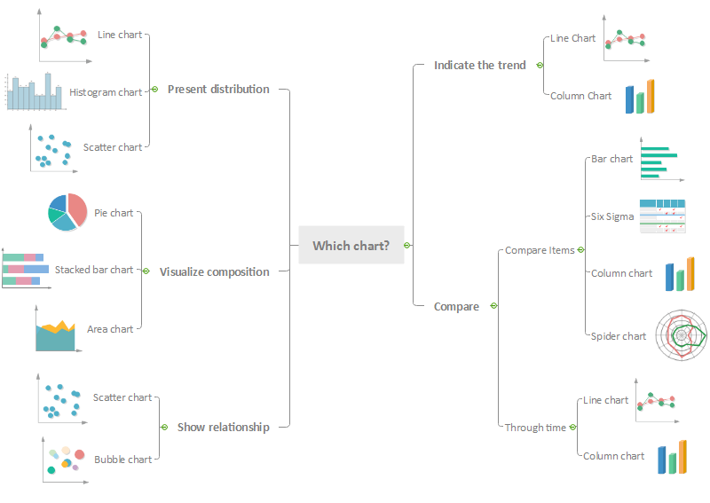

## How to choose the best chart type 
Source : https://blog.hubspot.com/marketing/types-of-graphs-for-data-visualization

* Column Chart : comparison among different items over time. *Start the y-axis at 0
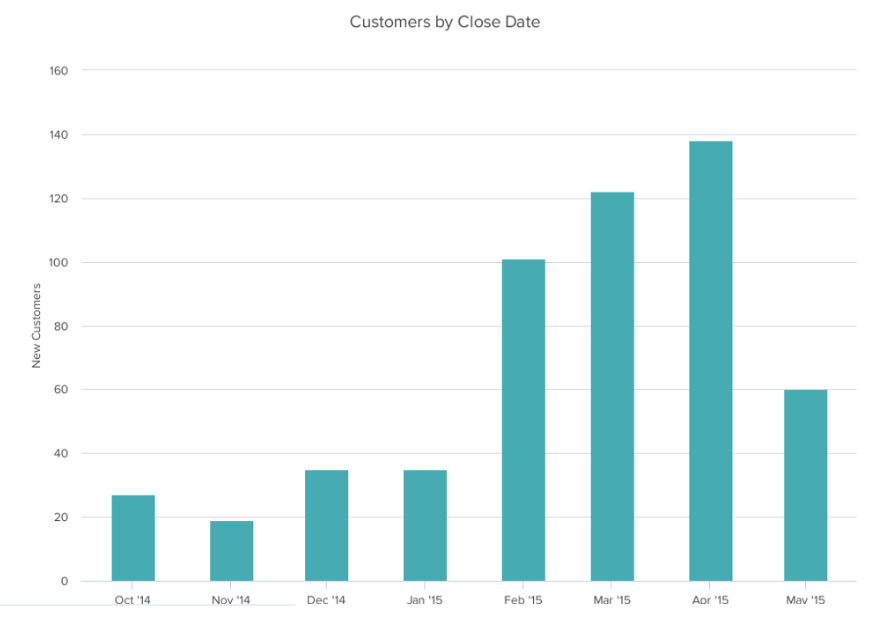

* Bar graph : horizontal column chart (Best : less than 10 items) *Start the y-axis at 0
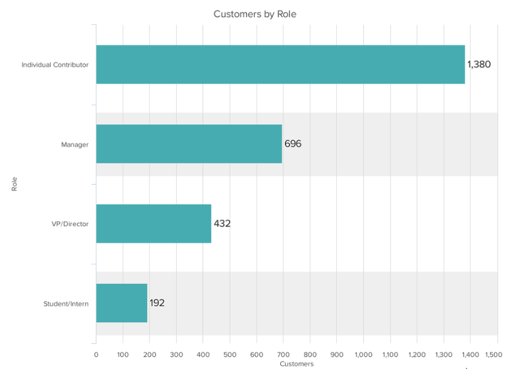

* Line graph : show trends over time (Best : less then 5 lines)
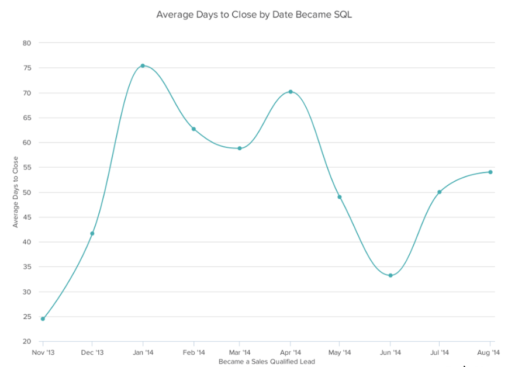

* Dual Axis chart : using two y-axes and share x-axis. (Best : using different graphing styles and colors)
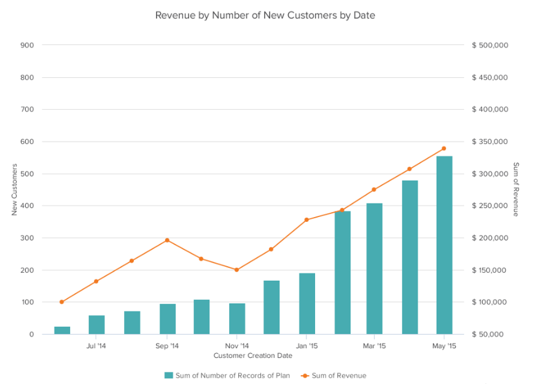

* Area chart : filled line chart which shows part-to-whole relations (Best : less than 5 categories)
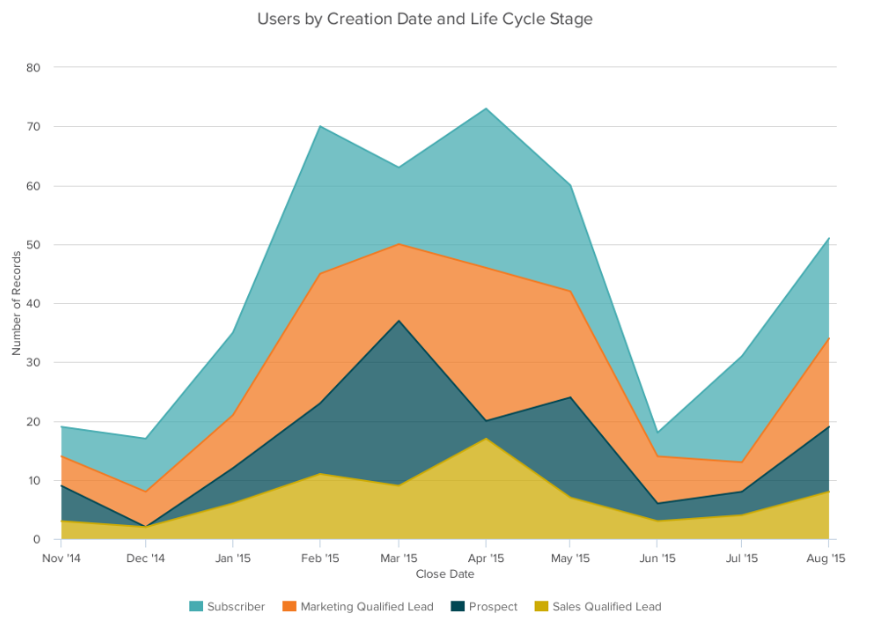

* Stacked bar chart : compare “many” different items (Best: part-to whole relationships)
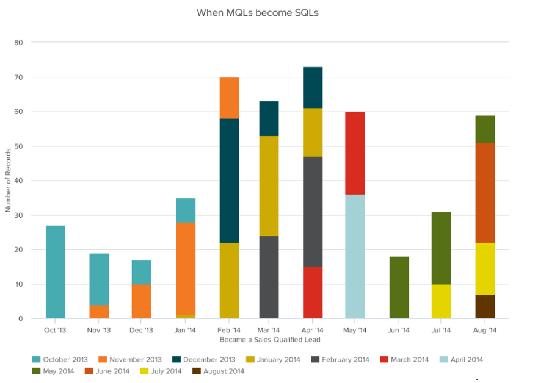

* Pie chart : shows a share of category (Best : less than 5 categories)
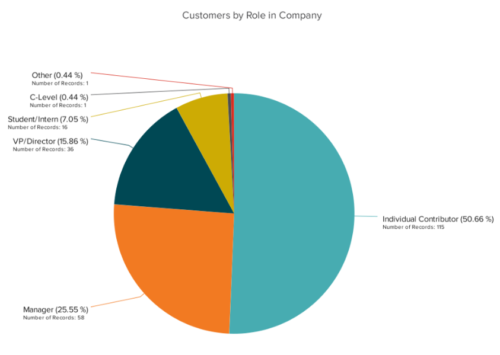

* Scatter Plot chart : show the relationship between two different variables or the distribution trends *start y-axis at 0
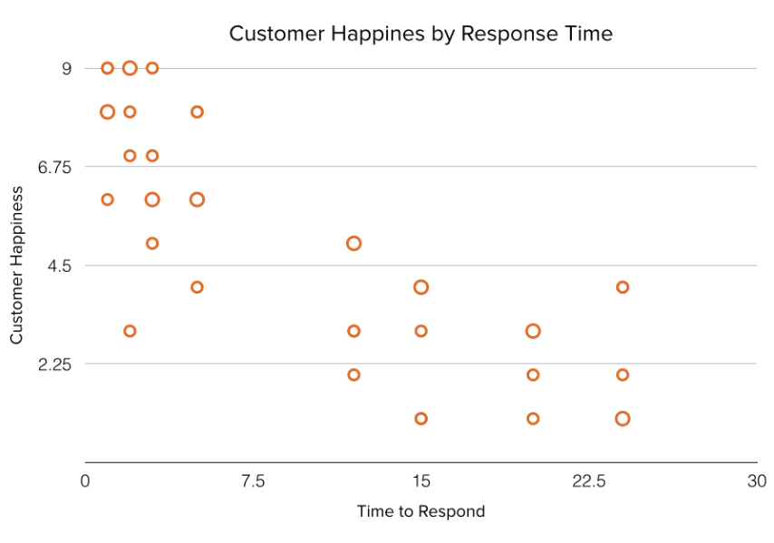

* Bubble chart : similar to a scatter plot chart, but it adds the size of the bubble 
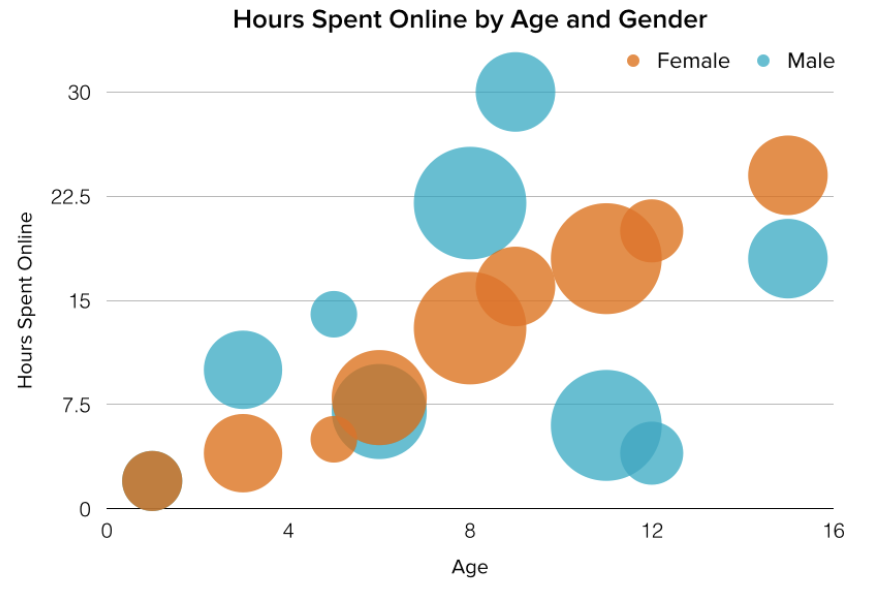

## Are you sure that it's THE BEST choice?
Source 1: https://blog.datawrapper.de/pie-charts/
Source 2: https://blog.datawrapper.de/line-charts/

1. When you use a pie chart, you need to consider if your data is accurately visualized. Pie charts are not the best choice if you want readers to compare the size of shares.The example below shows that the pie charts are not clear enough ! Even though there are less than 5 categories...
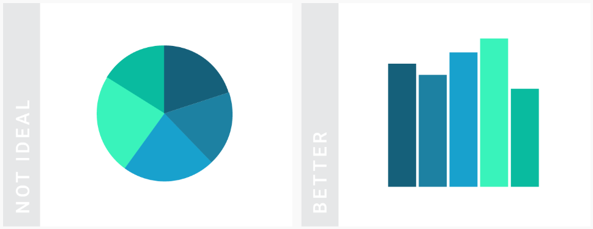

2. When there are many categories, you better choose another type of chart 
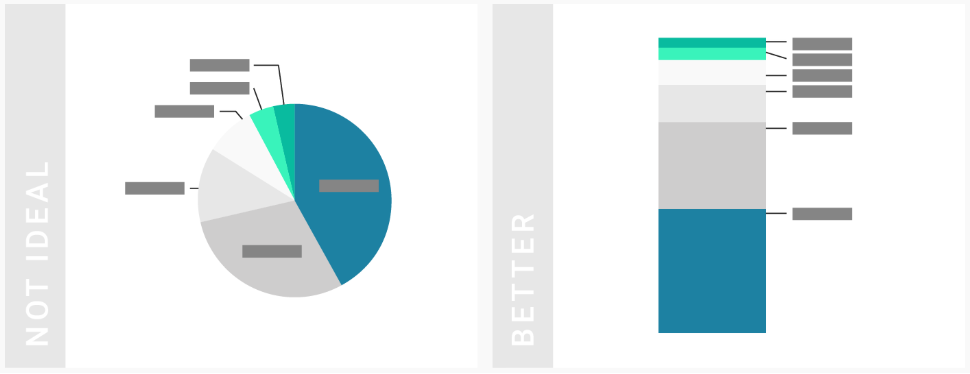

3. When there are some categories represent similar values...
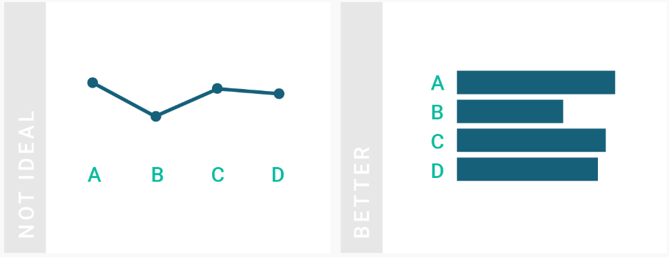

4. If the sum of your categories is as important as the categories itself, consider an area chart instead. 
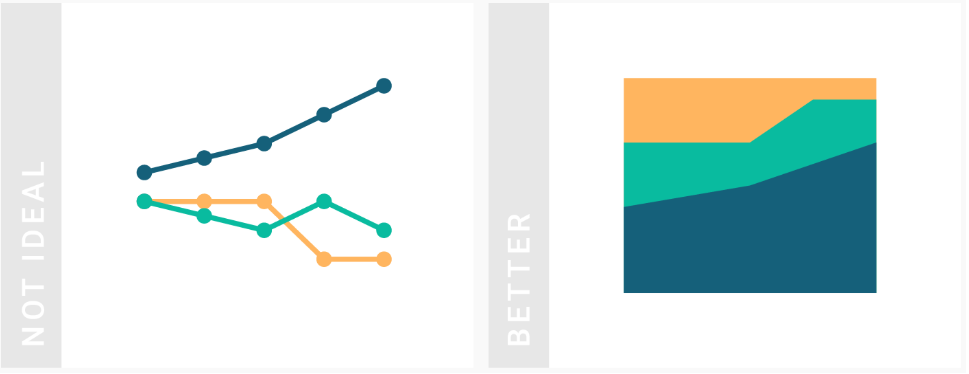

