## Excel Charts

Even though you've got a correct data result, if you don't visualize them well, it's hard to convince your audience or to communicate clearly. 

There are some check points when you choose excel charts :
1. Correct charts 
2. Make it clear to understand
2. Attractive

### Exercise 1 : Choose correct/clear excel charts (Data set : Food sales)
1. Select data > Insert > Choose an excel chart 
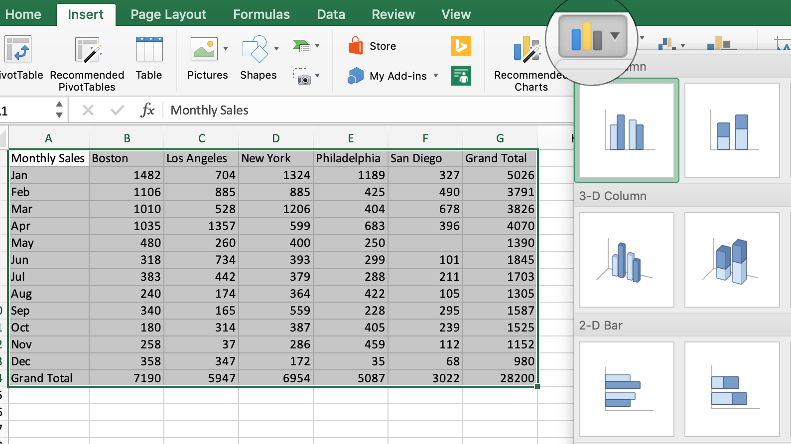

2. The result seems .... not very clear/hard to understand and attractive 
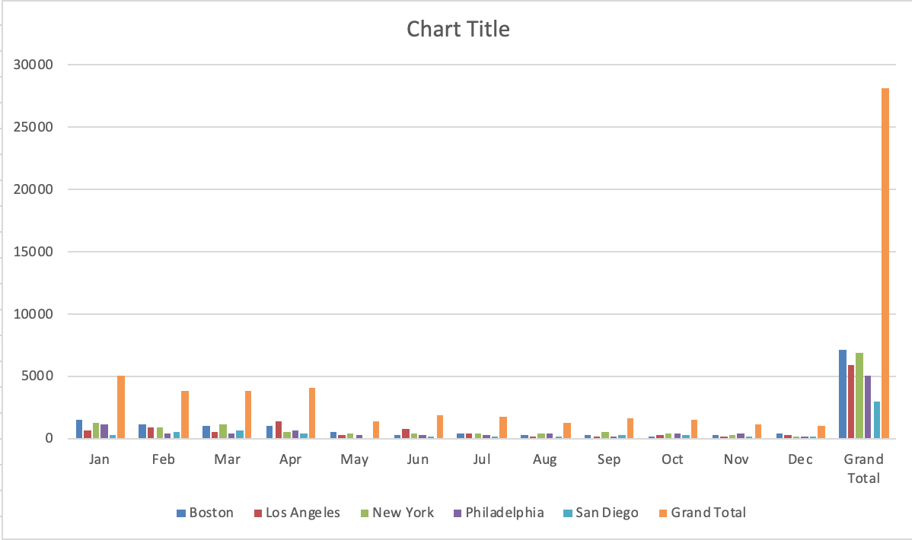

3. You need to get rid of "grand total". Select only the data that you need. 
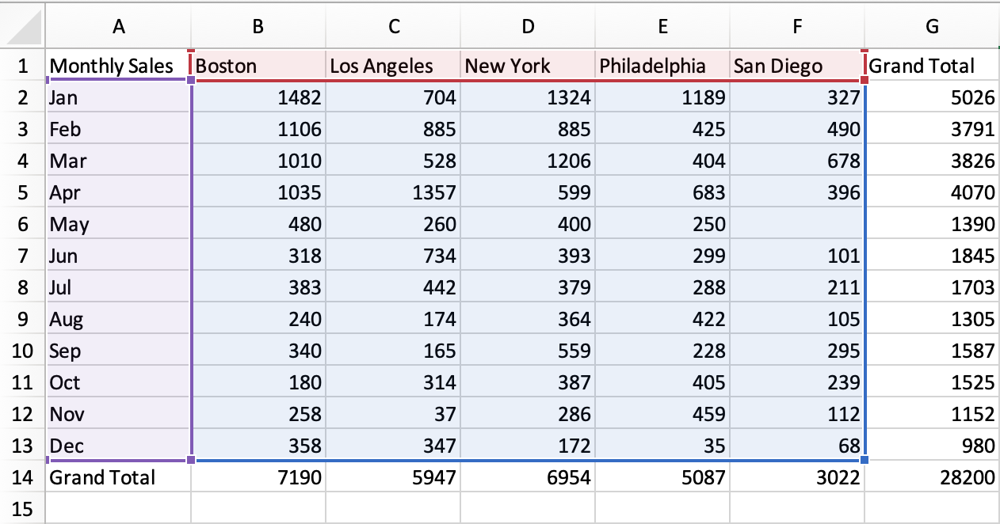

4. Now you have a clear graph but it's not easy to understand at a glance. So let's try another chart type.
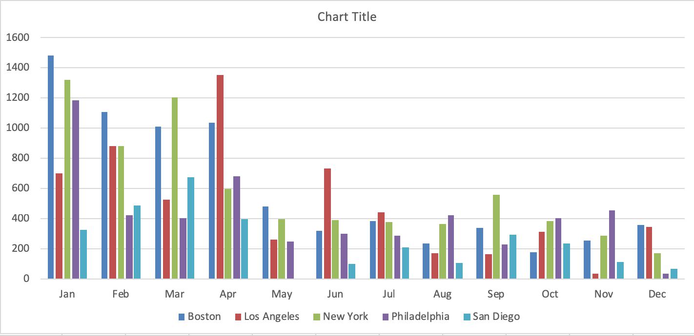

5. Change a chart type to "staked column"
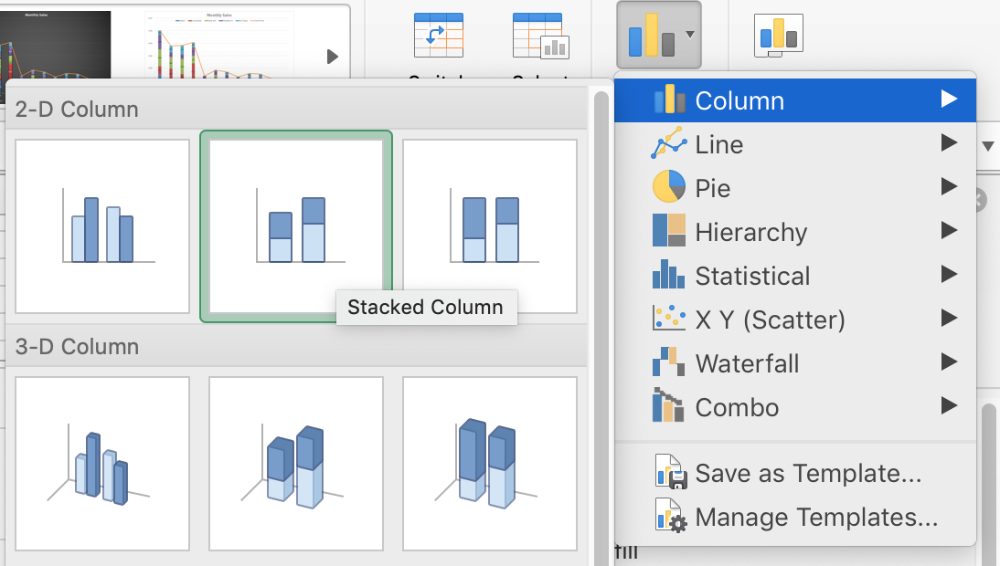

### Exercise 2 : Give more details in the chart (Data set : Food sales)

 * Title and Data labels (Center? Inside end? Outside end?)
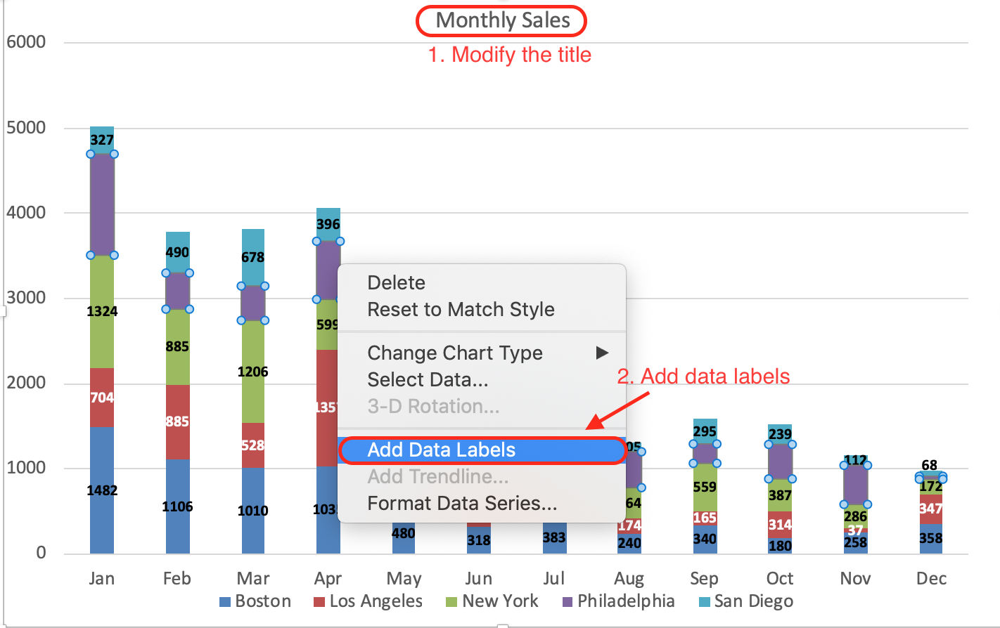

 * Using "Quick Layout"
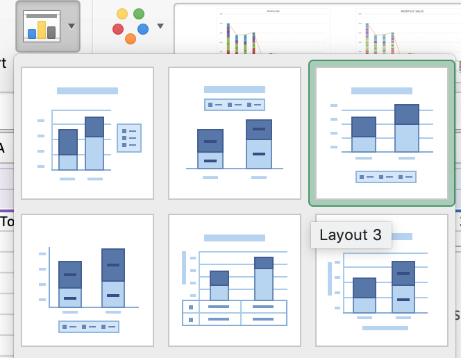

 * Result
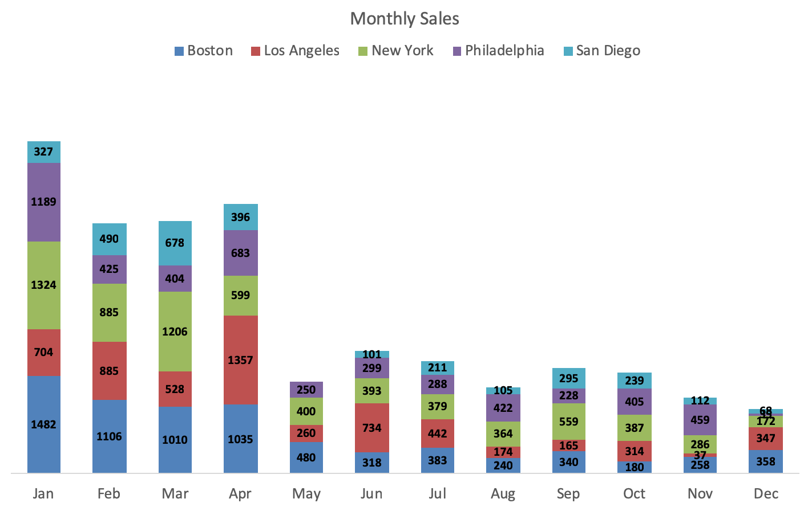

### Exercise 3 : How to add a Secondary Axis (Data set : Nike)
Source : https://blog.hubspot.com/marketing/add-secondary-axis-chart-excel

You need to put two different data in a graph. It means that the data shares X-axis but they have different Y-axes. In this case you need to add a secondary axis. 

1. Select data > Insert a bar chart.Identify the shared X-axis. In this case, the X-axis is "shoes sizes". What it means that you need to create another Y-axes.
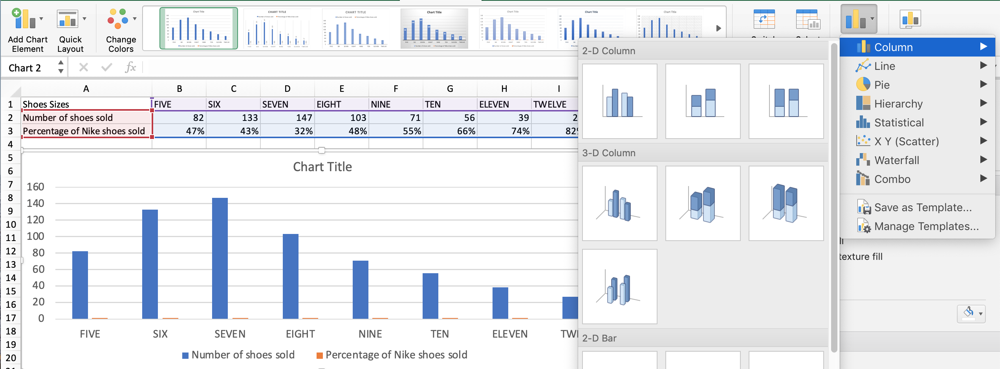

2. Click the bar chart of number of shoes sold and modify format data series. Now click the secondary axis.
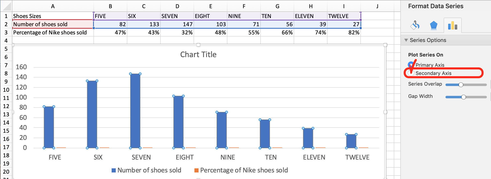

3. Now you have two Y-axes, but you need to change the chart format for the secondary axis. Click the bar chart of number of shoes sold and modify its type in "Line chart"
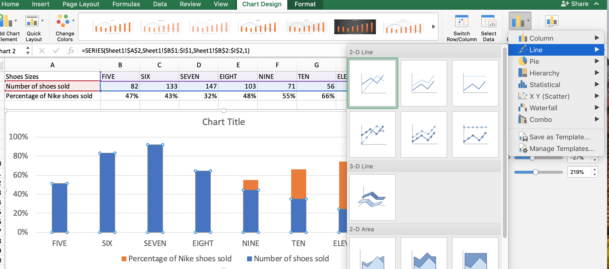

4. Now you try to put some details in the final graph (data labels and title).
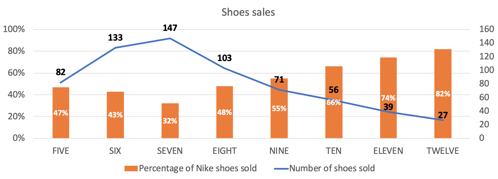

### Exercise 4 : Conditional Formatting & Sparklines

### 1. Conditional Formatting and "heat maps":

You don't have this particular file, but we can do it on another one.

 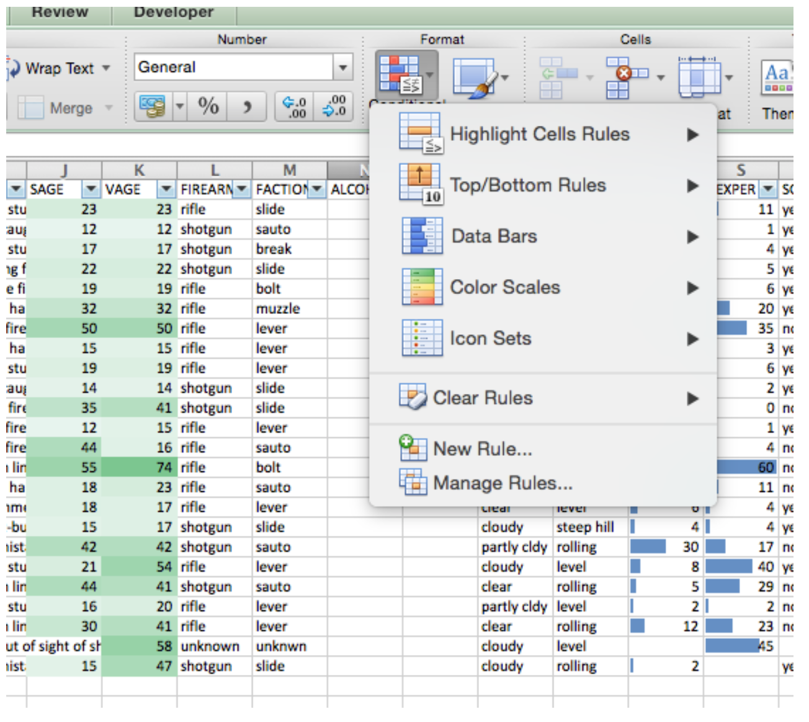

Heatmaps in the media:  
http://graphics.wsj.com/infectious-diseases-and-vaccines/ 

### 2. Highlighting Cells

 Highlighting duplicates is very useful for comparing  overlaps or finding uniques.   
 Shoot injuries, for instance.

 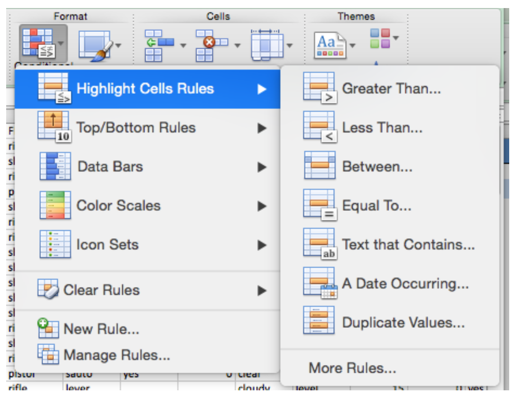

 You can go to town on formatting...

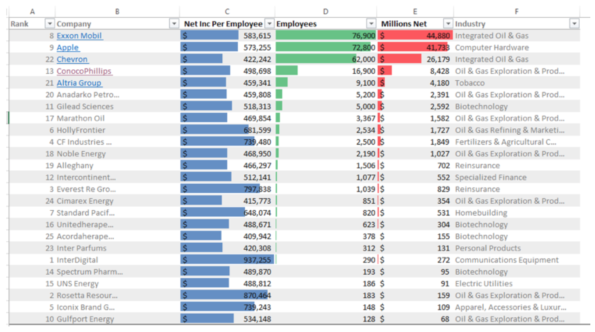

### 3. Sparklines (Data set : ParisRainfall)

 Insert tab, sparklines menu:

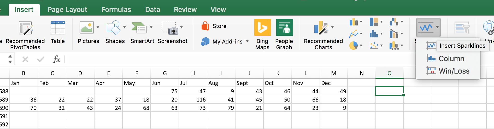

  Add to the right of the months.  

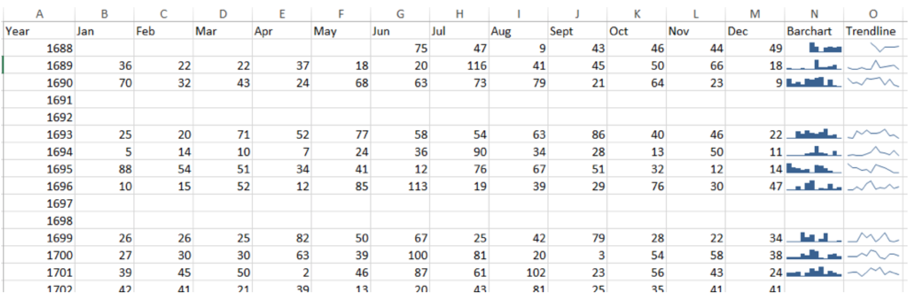

## General Design Tips
* Only color sparingly - use a different one for the
* Remove or reduce saturation of grids/axes and ticks (especially remove ticks)
* Add annotation or label on “interesting” points
* Have useful titles and axis labels.
* You can remove your legend if there is only one series shown.
