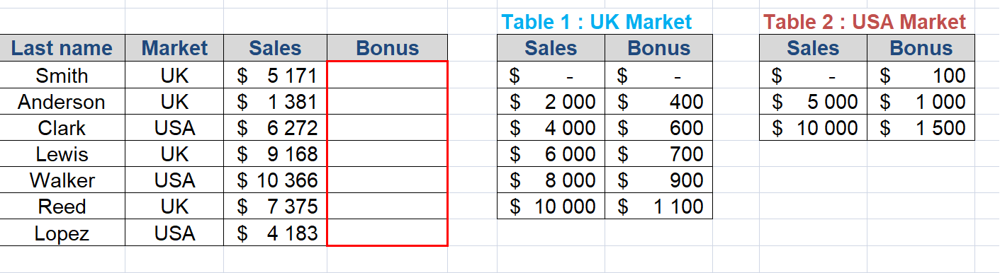

# VLOOKUP (short of "vertical" look up)
##### :zap: VLOOKUP is THE function globally used in service sector (consulting, finance, sales, marketing, RH etc) :zap:
* VLOOKUP function is to lookup a piece of information you’re searching for and feed you back information in the row it finds.

## Function = VLOOKUP( value, table, index_number, [approximate_match] )
* value 

lookup value

* table

range containing the lookup value

* index_number

the column number in the range containing the return value

* approximate_match

optionally specify TRUE for approximate match or FALSE for an exact match

Source : https://support.office.com/en-us/article/vlookup-function-0bbc8083-26fe-4963-8ab8-93a18ad188a1

## VLOOKUP EXERCISE 1 (data set : Runners)

Let's imagine that your manager sent you an original file, called "Runners", and he asked you to organize the table differently.

 

Now you need to work with :zap: VLOOKUP FUNCTION :zap:

 

## VLOOKUP EXERCISE 2 (data set : FT Workers NorthCenteral US 1999)

Let's imagine that your manager sent you raw data which contains information for more than 6,000 people !
Based on this file, he asked you to make a table which brings related data automatically (example below).
- The goal is that it brings the data automatically when you put "CODE"

 

* You can bring the data thanks to VLOOKUP function 
1. "Code" = manual input
2. Applying VLOOKUP function for others

* VLOOKUP ( $I$2, A:F , 2 , FALSE)

1. $I$2 = the information you want to find about

2. A:F = full data

3. 2 = work hours corresponds to the second column

4. FALSE

 

Let's apply VLOOKUP function in the table.

## VLOOKUP EXERCISE 3 (data set : Bonus)

Let's imagine that your manager asked you to put a bonus per employee.
The bonus will be applied based on the market that each employee attached to. 

 

* There are two different tables for each market. 
* It means that :
1. the table has to recognize two different tables
2. the table enables to match "the correct data" from two different tables

 

#### VLOOKUP( value,              table            , index_number, [approximate_match] ) ####
#### VLOOKUP(  C5  ,IF(B5="UK",$F$4:$G$9;$I$4:$J$6),       2     ,         TRUE        ) ####

*In this case, there are two tables (US & UK Market) so we use "IF" function to match the correct data

Let's apply VLOOKUP & IF functions in the table.

## VLOOKUP EXERCISE 4 (data set : salary)

When the function does not find the result, #N/A appears. 
From a professional point of view, it doesn't look clean.

 

Let's use IFNA function to replace the #N/A error 

 

Source : https://www.excel-easy.com/examples/vlookup.html
